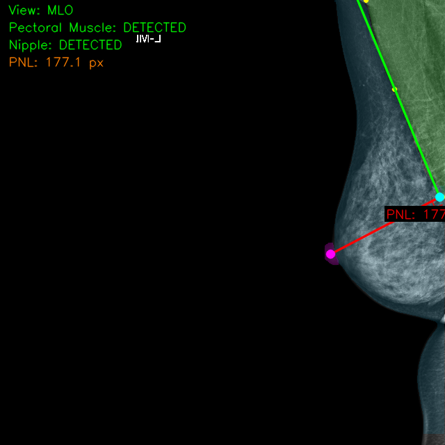
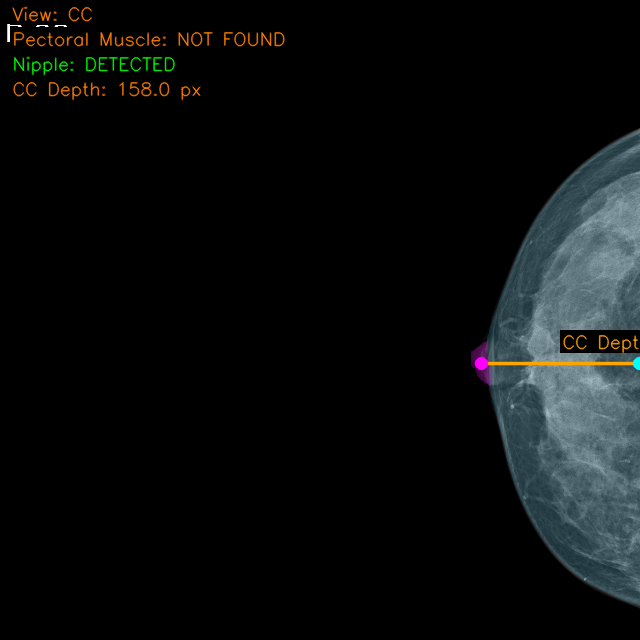

# Deep Breast Geometric Positioning & Segmentation pipeline

A unified, object-oriented pipeline for automatically extracting deep geometric features from Mammography imagery utilizing State-of-the-art YOLO segmentation models.

## Overview

This repository evaluates positional accuracy for diagnostic mammography views (MLO and CC). It deploys Ultralytics YOLO models to segment critical anatomical landmarks:
1. **Nipple**
2. **Breast Tissue**
3. **Pectoral Muscle**

Upon executing inference, the geometric analysis pipeline mathematically derives:
- **MLO View:** Fits an accurate boundary line aligning the pectoral muscle surface with the breast tissue boundary. Automatically calculates the **Posterior Nipple Line (PNL)** via geometric perpendicularly projected depth.
- **CC View:** Identifies the geometric Nipple centroid and projects a perpendicular horizontal vector measuring **CC Tissue Depth**.

---

## Architectural Principles (SOLID / OOP)

The codebase leverages strict **Object-Oriented Programming** principles to enable simple maintainability and independent testing:
- `SegmentationModel` (Single Responsibility Principle) - Dedicated exclusively to generating inference bounds against input variables.
- `MLOAnalyzer` - Receives agnostic output geometries from the segmentation layer and translates them into physical pixel distances. 
- `ResultVisualizer` - Completely detached drawing classes allowing headless pipeline usage without rendering overhead.

---

## Example Outputs

<table>
  <tr>
    <th>MLO View — Pectoral Line + PNL</th>
    <th>CC View — Tissue Depth</th>
  </tr>
  <tr>
    <td></td>
    <td></td>
  </tr>
</table>

---

## Installation & Setup

1. **Clone & Setup Environment**
   ```powershell
   git clone https://github.com/yourusername/segment_breast.git
   cd segment_breast
   pip install -r requirements.txt  # (Requires ultralytics, opencv-python, dataclasses)
   ```

2. **Configure Dataset**
   Insert your data into the `./images` and `./labels` tracking folders. Run the setup compiler to dynamically allocate Test/Train/Validation splits and produce the correct Yolo `data.yaml` layout.
   ```powershell
   python setup_dataset.py
   ```

---

## Configurable YOLO Backend
The framework integrates seamlessly with YOLO11 iterations, and remains backward-forward compatible (e.g. YOLOv8, YOLO26) natively using the `breast_seg/config.py` schema.

No hardcoding is required. Change the deployed model locally directly inside `config.py`:
```python
# Modifiable structure inside breast_seg/config.py
class Config:
    model_name: str = "yolo11n-seg.pt"  # Swap to yolo11s-seg.pt, yolo26.pt, etc.
    epochs: int = 100
    batch_size: int = 8
```

---

## Pipeline Execution Details

### 1. Training the Model
Trains your chosen segmented configuration targeting the `.yaml` payload map.
```powershell
python train_yolo.py
```
*(Optionally you can run training through `python run_train.py` wrapper route).*

### 2. Standard Diagnostics (Raw Inference)
Simply processes raw `.png` imagery from `./test/` into physical boundaries mask caches without advanced geometry calculation.
```powershell
python run_predict.py
```

### 3. Geometric MLO/CC Analysis
Runs the entire analytic workflow — producing pixel lengths, fitting positional boundary angles, determining missing anatomy profiles, and overlaying colored analytics on visuals. Output is routed to `analysis_output/`.
```powershell
python run_analysis.py
```

## Contributions
Please see `TODO.md` for our explicit feature list, including bounding-box doctor validations and ground-truth integrations. The pipeline is openly extendable for integration into other deep-health diagnostic packages.
